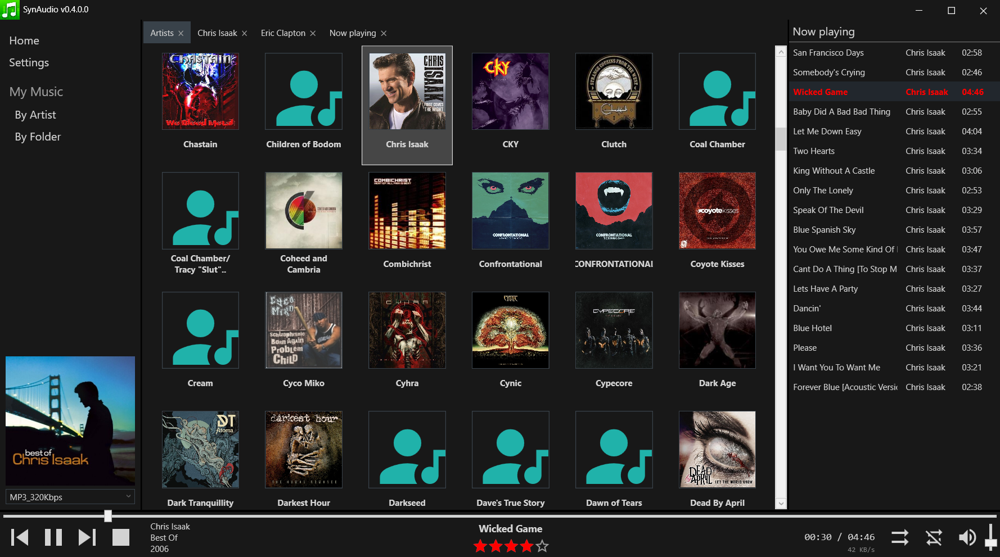
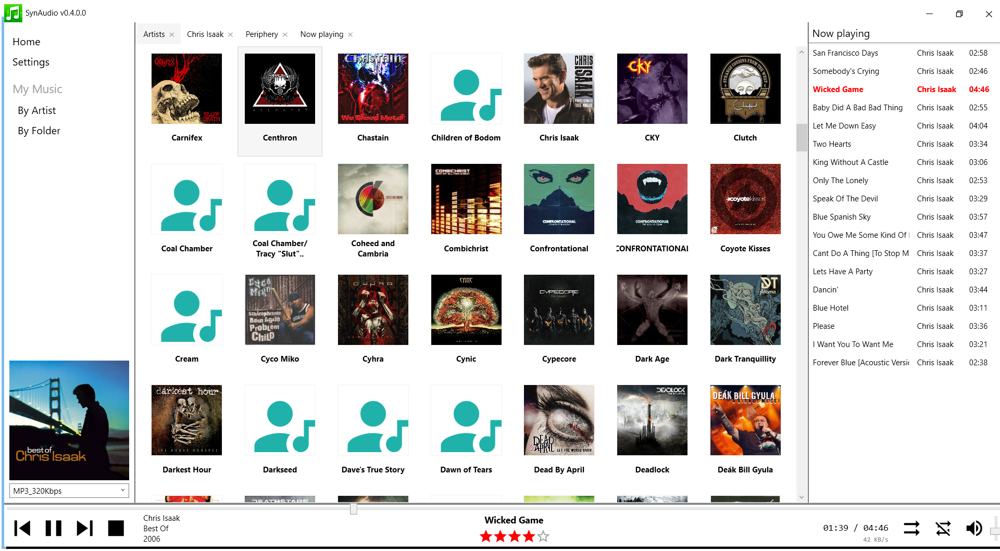

# SynAudio

AudioStation like **desktop application for Windows to stream music from your Synology NAS**. Built on top of my [SynologyDotNet.AudioStation](https://github.com/geloczigeri/synologydotnet-audiostation) package. It is under heavy development, but always stable. The music listening is already an easy-going and smooth experience with this app, I use it everyday.  

## Screenshots

  

  

## What's working
* Streaming from Synology NAS using the Audio Station library (shared + personal libraries)
* WAV or MP3 stream format support
* Browse artists
* Browse albums of an artist
* Browse songs in an album or all albums of an artist
* Display covers
* Rate song (5 star rating system)
* Shuffle, Repeat, Start, Stop, Pause, Seek, Volume, Mute
* Saves session, no need to login on next startup
* NowPlaying list
* Drag&Drop songs into NowPlaying
* Reorder songs list with Drag&Drop in the NowPlaying list
* Hotkey support (see below)
* Multiple tabs support (Ctrl + click a navigation item in the **My Music** section on the left)
* Local cache built from the Synology database, very fast browsing
* Automatic sync with the Synology database
* Faster than the original Audio Station, since this is a desktop application
* Restore playback position after restart
* Themes: Dark, Light

### Initial synchronization
The first sync will take some time depending on your library size. After the "Sync ..." message disappeared, please close and re-open your tabs.  
Automatic GUI refreshes will be implemented soon.  

### Partial sync
Partial syncs are triggered in the background when you navigate in the library.

### Hotkeys

#### Keyboard shortcuts
These keys are working only **if the the application is focused**.  

| Key combination | Action |
| - | - |
| Ctrl + S | Stop |
| Ctrl + P | Play |
| Pause | Pause |
| Alt + 0 | Clear song rating |
| Alt + 1 | Rate song to 1 star |
| Alt + 2 | Rate song to 2 stars |
| Alt + 3 | Rate song to 3 stars |
| Alt + 4 | Rate song to 4 stars |
| Alt + 5 | Rate song to 5 stars |
| Ctrl + Right | Seek 2 seconds forwards |
| Ctrl + Left | Seek 2 seconds backwards |
| Ctrl + Shift + Right | Seek 10 seconds forwards |
| Ctrl + Shift + Left | Seek 10 seconds backwards |
| Ctrl + Home | Seek to beginning |

#### Media hotkeys
These keys **always work**, even if the app is running **in the background**. Also works with **Bluetooth headsets**, so you can control the playback with your device.  
* Play
* Stop
* NextTrack
* PreviousTrack

### Navigation inside the application using the keyboard

#### Albums, Artists broser

| Key combination | Action |
| - | - |
| Home | Jump to first item |
| End | Jump to last item |
| Arrow keys | Move selection |
| ENTER | Open selected item |
| A-Z | Jump to the first item what's name starts with the pressed letter |
| Double-Click | Open this item |
| Shift + Click | Multi-Select |
| Right-Click | Open context menu |

#### Song list

| Key combination | Action |
| - | - |
| Page-Up | Navigate one page upwards |
| Page-Down | Navigate one page downwards |
| Arrow keys | Move selection |
| ENTER | Play selected items |
| Double-Click | Start playback with current list from the clicked song |
| Shift + Click | Multi-Select |
| Right-Click | Open context menu |
| Drag&Drop | Songs can be dropped into the NowPlaying list |

## Coming soon

### Massive user interface improvements
Until recently I could focus mainly on under-the-hood components, like the synchronization and the Synology API implementation, so I simply haven't got the time needed to finish the GUI, this is why you see standard controls. 
* Dark theme support
* Skins
* Improve layout and the GUI in general
* Add more useful functionalities

### Personal music library support
Only the shared music library is displayed at the moment in this app, so you see items from your "/music" folder on your NAS. 
The personal library is filled from your "/home/music" folder and visible only to you. I plan to implement this, so this app will be able to display music content from your personal music folder as well.  

### Many more various improvements

Apart from sability improvements and bug fixes, I want to implement most of the functionality available in the original Audio Station app, and implement features which are simplfy not possible with it. 

## Screenshots

