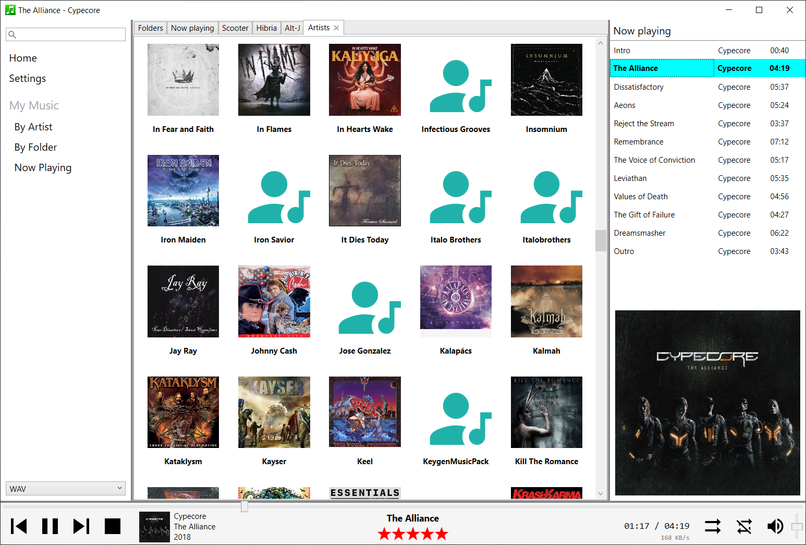
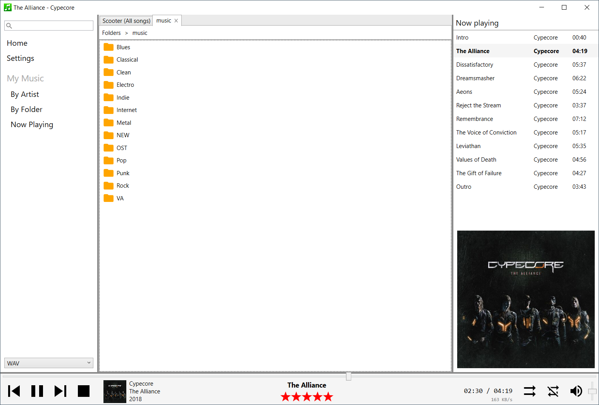

# SynAudio

Synology AudioStation like desktop application.
It is already in a stable working state, but it is under heavy development.  

  

* Streaming from Synology NAS
* WAV or MP3 stream support
* Browse artist
* Browse albums in an artist
* Browse songs in an album or all albums of an artist.
* Display covers
* Rate song
* Shuffle, Repeat, Start, Stop, Pause, Seek, Volume, Mute
* Saves session, no need to login on next startup (does not save password!)
* NowPlaying
* Drag&Drop songs into NowPlaying
* Reorder songs list with Drag&Drop
* Multiple tabs support
* Local cache built from the Synology database, very fast browsing.
* Automatic sync with the Synology database
* Fast! (way faster than the original Audio Station)

## Initial synchronization
The first sync will take some time depending on your library size. After the "Sync ..." message disappeared, please close and re-open your tabs. 

## Partial sync
Partial syncs are triggered in the background when you navigate in the library.

## Coming soon

Under heavy development, but always stable. The GUI will be improved a lot.
I focused mainly on under-the-hood components like the synchronization and the Synology API implementation.
The GUI is minimalistic, but usable and super fast.

## Screenshots

